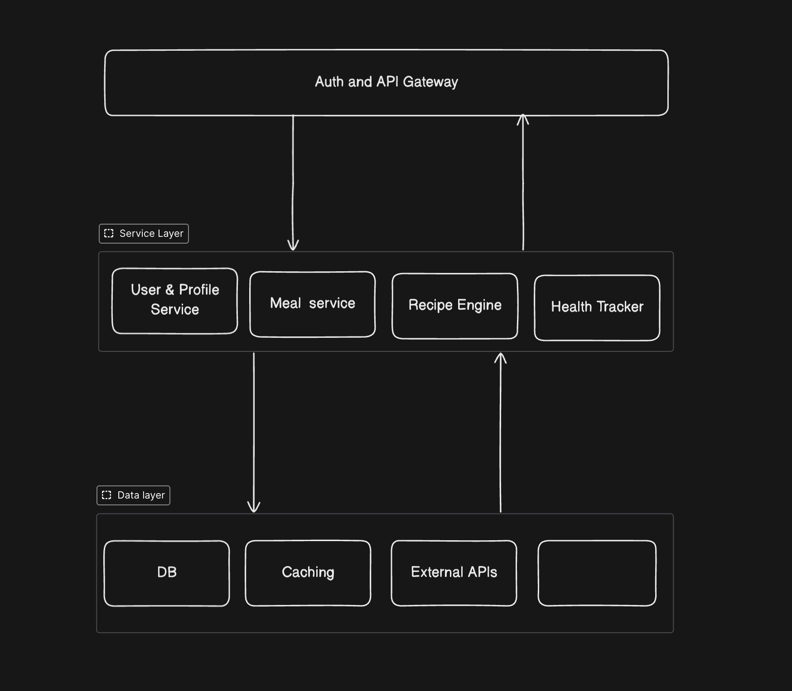
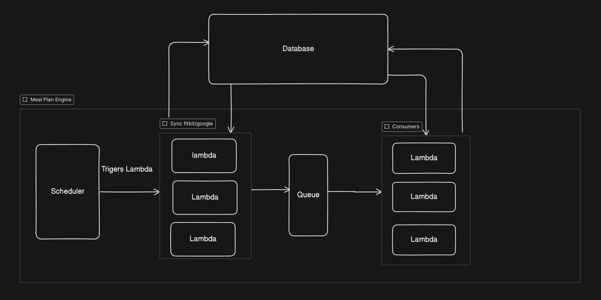

### Project Setup

```shell

# install requirements
  pip install -r requirements.txt
  
# run local dev server
  fastapi dev main.py
  
# get the docs
  http://127.0.0.1:8000/docs
```

## Meal Plan Optimizer

`You can't manage what you can't measure.`

Meal Plan optimizer helps you to be in track with your health goals.
It suggests you meals after tracking your daily activity and lifestyle choices.
Save your meal preference and grocery inventory to get meals suggestions.

### Unique Value proposition

1. Grocery Inventory: Upload the image of the bill, or manually enter what you bought.
2. Activity Tracking: Connect with different health bands and watches to get the detail of your health
3. Workout Progress: Track your workout.

##### Future scope
1. Grocery Inventory: we can upload images of bill to prepare the inventory, but as different shops and market
has different way writing the item name, it would be slightly challenging to get the correct data. 

We can build a inventory system for tracking the items the user have,
Or can use LLMs if user can upload the images of the items, we can generate meals according to that.
Also, if user's inventory is big, we will try not to repeat the suggested meals.


##### Assumption

- Users are spread globally
- Have daily 100k DAU across 24 timezones


### Technical Strategy

#### API Layer
1. FastAPI-based REST API with automatic OpenAPI documentation
2. Authentication using Mobile number,
3. Registration only happens after a successful otp verification
4. JWT-based authentication

#### Business Logic
1. User Profile Manager
2. Workout Logger
3. Integration with 3rd party apps for logging more detailed data


### Datalayer

1. PostgreSQL: Primary database for user profiles, recipes, meal plans, and health data
2. Redis: for caching
3. External APIs:

`Note: for local dev I have used sqllite`


### Meal Plan Generator Engine

##### How it works:
We look at what you did yesterday (steps, workouts, calories burned) and create today's meal plan based on that.

##### What we use:
- Yesterday's activity data from Fitbit/Google Fit
- Your target weight and dietary preferences
- Simple rules to match meals to your activity level


#### Data Processing & Meal Generation Logic

Overnight processing pipeline

##### Data Collection
- Sync yesterday's fitness data from all connected apps
- Batch process users by timezone (sync when it's 3 AM in their local time)
- Rate-limited API calls: 50 requests/minute to avoid hitting Fitbit/Google Fit limits
- 

- We schedule it to run over night.
- Depending on the user, we can split the data in multiple processors to process the data and generate the meal plan.
- We will give 3 different recipies for each meal, and some snacking options.
- 

##### Delivery
- Cache generated meal plans in Redis
- Send push notifications when users typically wake up
- Store backup plans in database


#### Failure Handling

- If fitness sync fails → use user's baseline activity level
- If recipe selection fails → fallback to previous day's plan
- Queue retry for failed users during next processing cycle


#### Scalability:
- 100k users = ~4,200 users per hour across 24 timezones
- Each worker processes ~1,000 users/hour
- Auto-scale workers based on queue length


### Data Flow Architecture
<p align="center">

</p>


### Meal Plan Generator Engine

<p align="center">

</p>


### Compliance

1. GDPR: Allow customer to export their data and delete it if they want
2. API Security: OAuth2/JWT authentication


### Folder structure:

- api: contains all the endpoints
- db: 
  - db/schemas: schema for request and response
  - db/models: Models for interacting with database
- images: all the images in the md file
- integrations: 3rd party integration for   
- services: all the business logic

